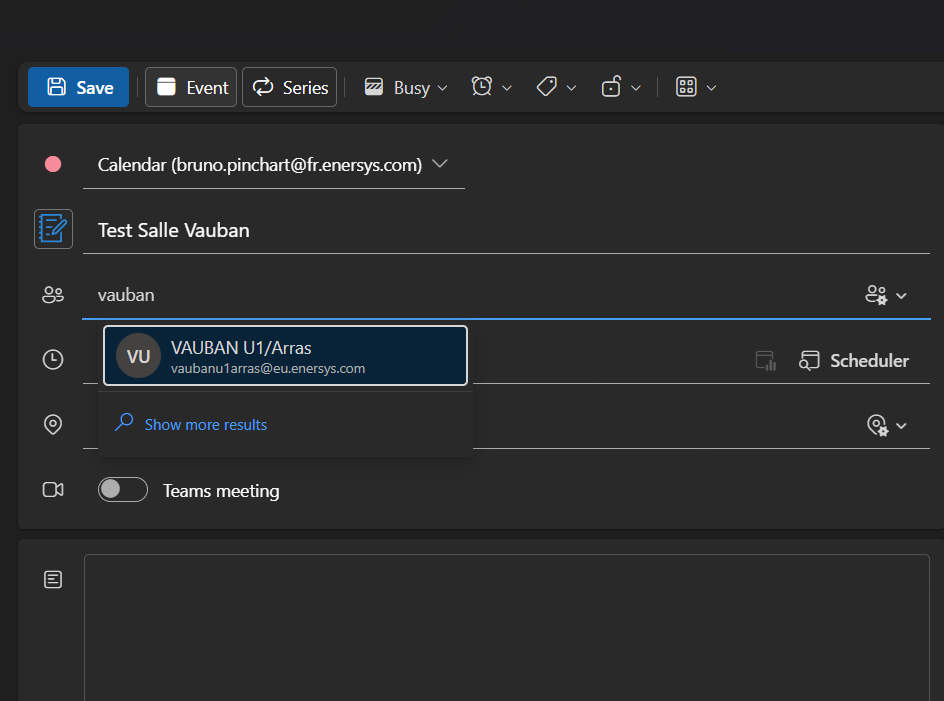
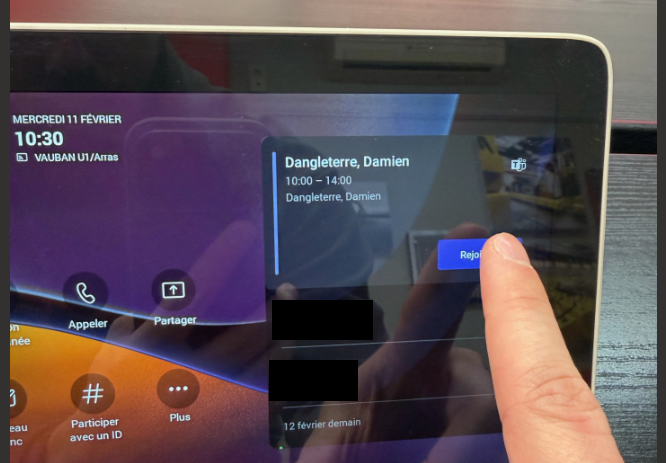
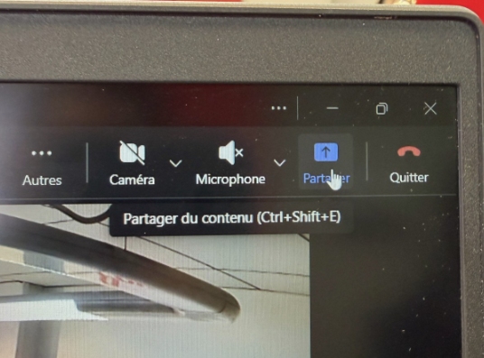
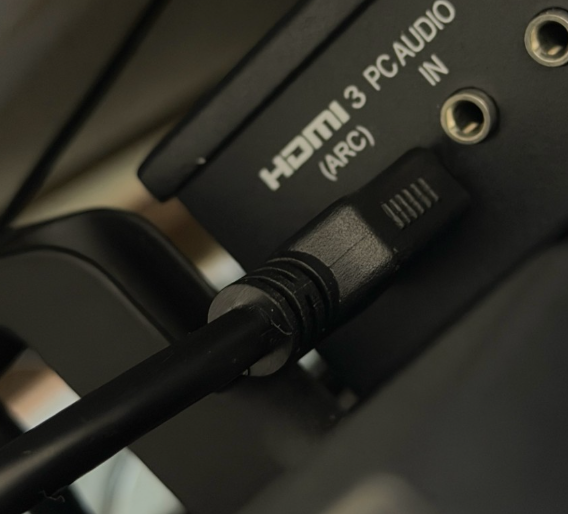
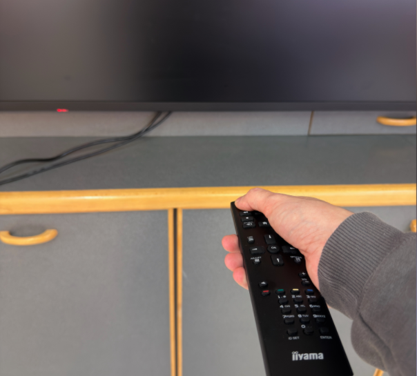
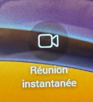

# Meeting Room Guidelines — Vauban U1 / Arras

> **Room:** Vauban U1 — i've made this procedure during my internship 
> **Equipment:** Microsoft Outlook + Teams · Poly dock station · iiyama display

---

## I. Book the Room (Outlook)

Reserving the room through Outlook is **mandatory** — it prevents double-booking and automatically blocks the room's calendar for the selected time slot.

1. Open **Outlook** and go to the **Calendar** view.
2. Click **New Meeting** to open the meeting creation form.
3. In the **Add a room** field, type `vauban` and select:
   > **VAUBAN U1/Arras** — `vaubanu1arras@eu.enersys.com`
4. If the meeting requires remote participants, toggle on **Teams Meeting** — this will automatically generate a Teams link and include it in the invitation.
5. Add all **attendees** in the required/optional fields.
6. Set the **date, start time, and end time**, then click **Send**.

> ⚠️ Always check the room availability in the **Scheduling Assistant** before confirming the booking to avoid conflicts.

---

## II. Start the Meeting — Poly Dock Station

The **Poly dock** is the touch tablet located in the meeting room. It is synchronized with the room's Outlook calendar and displays upcoming meetings automatically.

1. On the Poly screen, locate your meeting — it will appear with the organizer's name, start and end time.
2. Tap the **"Rejoindre" (Join)** button on the right side of the screen to start the Teams meeting from the room's equipment (camera, microphone, and display will activate automatically).

> The room's audio and video are now active. Participants joining remotely via Teams will see and hear the room.

---

## III. Share Your Screen

If you need to present content from your own PC during the meeting:

1. On your PC, open **Microsoft Teams** and join the same meeting.
2. In the Teams meeting toolbar, click the **Share** button (↑ icon) or use the shortcut `Ctrl + Shift + E`.
3. Choose the sharing mode:
   - **Full screen** — shares your entire desktop
   - **Window** — shares only a specific application
   - **Tab** — shares a specific browser tab (useful for web-based content)

> Your screen will be displayed on the room's TV via the Poly system. Remote participants will also see the shared content in Teams.

---

## IV. Tips & Troubleshooting

### TV input — HDMI 3
Make sure the room's TV is set to **HDMI 3** input. If the screen is black or shows no signal, use the TV remote to switch to the correct HDMI source.

### Remote control
The TV remote must be used **within 3 meters** of the screen. Point the remote toward the **LED sensor located at the bottom-left corner** of the screen for it to register.

### Wi-Fi access for external guests
Participants who are **not part of EnerSys EMEA** do not have access to the corporate Wi-Fi. To get guest Wi-Fi credentials for external attendees, contact the **IT service** before the meeting.

### Instant meeting (no prior booking)
If you need to start an unplanned meeting directly from the room, tap **"Réunion instantanée" (Instant Meeting)** on the Poly screen and invite guests from there — no Outlook booking required.

